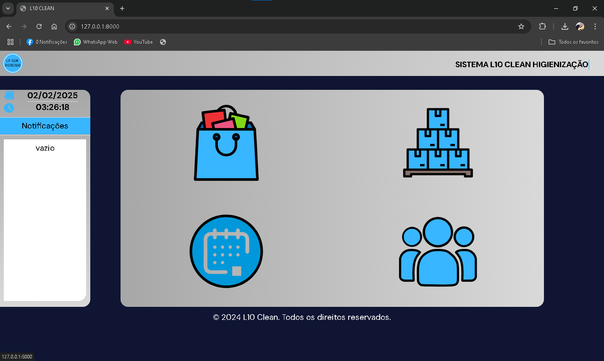

<h1 align="center">L-10 Clean</h1>

<h4 align="center"><a href="https://l10clean.vercel.app">Confira o projeto aqui</a></h4>

L-10 Clean é um sistema de gerenciamento de estoque que controla entradas e saídas de produtos, fornece notificações quando o estoque está abaixo do nível mínimo e gera listas de impressão para itens abaixo do estoque mínimo.

O projeto é composto por:
Entrada e Saída de Produtos: Permite registrar todas as entradas e saídas de produtos no estoque.

Notificações: Exibe alertas quando o estoque de um produto está abaixo do nível mínimo configurado.

Relatórios: Gera listas de impressão para itens que estão com estoque mínimo.

Gerenciamento Completo: Proporciona uma visão geral do estoque, facilitando o controle e gerenciamento.

📚 Alguns conceitos aplicados
Neste projeto, foram aplicados os seguintes conceitos:

Desenvolvimento com Python e Django

Manipulação de dados com Pandas

Criação e gerenciamento de banco de dados

Responsividade e design intuitivo

Utilização de bibliotecas e frameworks adicionais

🚀 Tecnologias Utilizadas
Django: Framework web utilizado para desenvolvimento do projeto.

Python: Linguagem de programação principal.

Pandas: Biblioteca utilizada para manipulação de dados.

HTML/CSS: Para estrutura e estilização do front-end.

JavaScript: Para funcionalidades dinâmicas e interativas.

Bootstrap: Framework CSS para responsividade.
